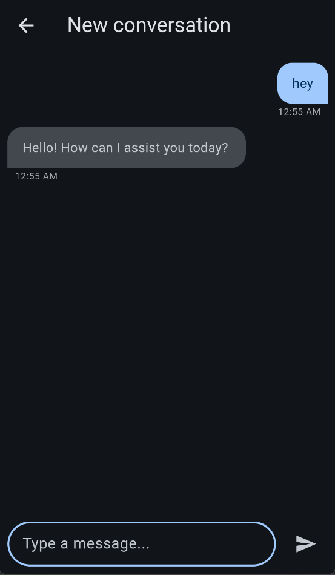

# mo_ai_agent

## 🧠 AI Assistant

**Mo Ai Agent** is an AI-powered assistant built with **Flutter**, leveraging **Claude AI** and following **Clean Architecture** principles. The app runs entirely on-device with no backend dependencies and supports both **Light** and **Dark** themes.

---

## 📸 Screenshots

| Dark Mode Screens |
|-------------------|
|  |
|  |
|  |

---

## ✨ Features

- 🤖 Chat with an AI assistant powered by Claude AI
- 💾 Store conversation history locally using `sqflite`
- 🌗 Light and dark theme support
- 🧱 Clean architecture using BLoC/Cubit and Dependency Injection
- 🛠️ Runs fully on-device (no server-side backend required)

---

## 🚀 Getting Started

### ✅ Prerequisites

- [Flutter SDK](https://flutter.dev/docs/get-started/install) (latest stable version)
- Claude (or OpenAI) API key

---

### 🛠 Installation

1. **Clone the repository**:

```bash
git clone https://github.com/yourusername/mo_ai_agent.git
cd mo_ai_agent
